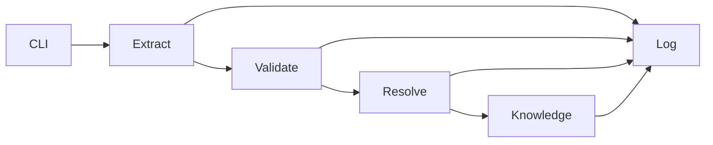

# Architecture and interfaces

The CLI loads UTF-8 files and invokes four services through shared, schema-enforced
Python boundaries. HTTP wrappers expose the same request and response objects.
Payloads carry content rather than server-side file paths. This makes the resolver
independent of the extraction host and keeps filesystem handling at the CLI edge.

Extraction will propose evidence-backed elements through local Ollama or direct
Google Gemini, selected explicitly. Offline mode will use validated content-based
replay or conservative rules without provider access. Validation decides
whether the note can proceed. Resolution reads only the validated note and register;
knowledge reads only the guideline and optional validated note. Neither resolution
nor knowledge imports the model adapter. Each service has a separately addressable
health endpoint and one POST processing endpoint. Pipeline execution is in-process
to avoid requiring Docker for the grading CLI.

## Public data contracts

`schemas/` holds draft 2020-12 JSON Schemas. Every input and output is checked at
the shared boundary, and HTTP additionally validates requests and responses. The
note has exactly Appendix A's section keys; each value is NOT_STATED or a nonempty
list. Each element has value, span {ref, text}, confidence, and assessment certainty
where required. Extra element metadata is allowed for attribution and auditability.

context_span has the same {ref, text} shape as span, but supplies conversational
context rather than evidence for the value or its numbers. conflict has {id,
reason}; contradictory elements share an id and each retains its own primary span.

Resolve preserves all sections and elements, adding code, code_system, confidence,
alternatives, and status. NOT_STATED stays a string. For unresolved elements code
is null and code_system is the empty string. An ambiguous result also has null code.
Extraction confidence can be retained as extraction_confidence when the required
confidence field becomes the matching score.

Probable and differential diagnoses remain eligible for resolution, with certainty
preserved. Conflicts and considered_and_rejected elements always remain uncoded.

Knowledge returns rows, not_in_corpus, and prose. Row fields express conditions,
actions, severity, alarm features, or test constraints; source, section, page, and
quote are mandatory. The standalone command has no patient input unless --note
is supplied, so its prose is conditional. Pipeline supplies the validated note.
Neither rows nor not_in_corpus may depend on that optional note.

## Execution configuration

The CLI accepts --provider ollama|gemini or --offline for check, extract, and
pipeline. An explicit provider overrides SCRIBE_PROVIDER; offline ignores provider
environment settings. Explicit --provider together with --offline is a usage error.
Local Ollama defaults to qwen3:1.7b. Gemini uses GEMINI_API_KEY and defaults to
gemini-3.1-flash-lite. Provider failures are visible and never switch execution mode.

These arguments and readiness diagnostics exist in the CLI milestone. Extraction
adapters, offline replay, and runtime service enforcement follow in their scheduled
milestones; schema availability alone does not mean a service is implemented.

## Failure and audit boundaries

Exit 0 means success; exit 1 means processing/validation failure; argparse uses exit
2 for incorrect usage. Errors name the stage and input, with a row where possible.
CLI diagnostics use stderr. Output files are replaced atomically only after a
successful stage. Existing pipeline artifacts are not silently reused.

Run logs contain one terminal record per stage, including skipped stages after a
failure. Hash file content or canonical JSON at each stage; use SHA-256 of empty
bytes for an absent output. Model and prompt_hash are null outside extraction.
Timestamp records use timezone-aware ISO 8601. Logs do not include transcript text.

## Scaling and rule changes

At ten times the load, queue extraction with bounded concurrency and explicit
timeouts; scale validation and resolution independently. Monitor queue age, model
latency/errors, rejected facts, unresolved/ambiguous rates, schema failures and
stage completion. Do not place patient content in metrics labels or routine logs.

Version normalization and matching rules with the catalogue hash. Keep immutable
resolved artifacts and opt-in replay of affected notes; releasing a rules version
does not rewrite history. At catalogue scale, build kind-partitioned alias indexes
and deterministic candidate retrieval with stable ordering and logged scoring.
