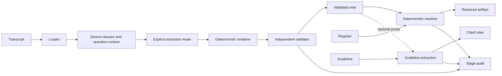

# Clinical coder architecture

## System boundaries

Model-assisted evidence selection is separated from deterministic validation,
catalogue lookup, and guideline extraction. Only the extraction provider adapter
may invoke a model. The resolver and knowledge components must not import or call
provider clients.

The CLI is the filesystem boundary: it reads explicit paths, parses UTF-8 content,
invokes stage functions, and writes validated artifacts. HTTP wrappers receive
content in JSON rather than arbitrary server-side paths. Both forms use identical
stage contracts.

Extraction and validation implement the flow below. The resolver, knowledge, service,
and pipeline sections specify their integration design; completion is tracked in
GitHub Issues.

## Component responsibilities

| Component | Responsibility | Prohibited behavior |
| --- | --- | --- |
| CLI/loaders | Arguments, strict parsing, file errors, output writing | Guessing absent input |
| Evidence processor | Preserve turns, segment clauses, identify context | Inventing or translating values |
| Provider adapters | Bounded source selection | Receiving the register or emitting codes |
| Renderer | Copy evidence and attach source-derived metadata | Free clinical summarization |
| Validator | Verify source, numbers, attribution, and scope | Model-based acceptance |
| Resolver | Kind-aware lookup and ranked alternatives | Inferring diagnoses or calling models |
| Knowledge extractor | Source-derived rules and quotations | External clinical knowledge |
| Pipeline/audit | Contracts, sequencing, terminal records | Treating stale output as success |

Application code is under `src/clinical_scribe`; tests and independent fixtures are
under `src/tests`. Public schemas are in `schemas/`, exact prompts in `prompts/`,
and design documents in `docs/`.

## Extraction data flow

1. Parse speaker turns without rewriting evidence. Reject invalid timestamps,
   unsupported speakers, empty turns, and duplicate source references.
2. Segment complete clauses while preserving decimals and clinical qualifiers.
   Associate patient replies with supported preceding doctor questions.
3. Identify conservative candidate sections from speaker, context, and explicit
   clinical cues. Retain the original turn and quotation for every candidate.
4. Obtain source selections through the requested mode. Model output contains
   identifiers and permitted sections, not clinical prose or codes.
5. Copy selected source excerpts into values; attach timestamps, attribution,
   contextual spans, source-derived certainty, and detected conflicts.
6. Independently validate the resulting note before writing or returning it.

Unsupported selections fail. Removing an outer JSON Markdown fence is transport
handling; editing clinical content is not. Invalid or incomplete provider output
must not trigger a hidden provider switch or silent clinical repair.

### Provider and offline modes

Ollama uses a configured endpoint/model, temperature zero, disabled thinking,
CPU inference, bounded context, and bounded output. The default is qwen3:1.7b.
Readiness distinguishes executable, server, and model availability.

Gemini uses generateContent with GEMINI_API_KEY in a header and a configurable
model. Require a completed response and validate its selection schema. Readiness
checks metadata access; it does not establish generation quota or clinical accuracy.

Offline execution compares canonical transcript content with a replay manifest.
A match requires note-hash verification and validation against the actual input.
Otherwise use conservative rules or explicitly abstain when patient content cannot
be classified safely. Offline execution never contacts a provider.

An explicit --provider overrides SCRIBE_PROVIDER. --offline excludes explicit
--provider and ignores provider environment settings. Timeout, authentication
failure, and invalid generation do not select a different execution mode.

## Data and provenance contracts

The note has exactly the 13 Appendix A sections. Each is NOT_STATED or a nonempty
list. Required element fields are value, span {ref,text}, and confidence; assessment
also requires certainty. Extra metadata cannot weaken those requirements.

Primary spans supply factual evidence. context_span explains a conversational
relationship but cannot supply missing facts or numbers. Attribution records the
source speaker. Rejected thinking-aloud uses considered_and_rejected. Contradictory
statements share conflict {id,reason}, each with its own primary span.

The renderer's confidence of 1.0 describes exact evidence copying, not diagnostic
probability or extraction completeness. Clinical certainty is separate. Evaluate
coverage independently from grounding validity.

## Independent validation

Accept source-backed values and a small documented set of numeric/unit equivalents.
Check complete clinical clauses so a shortened span cannot remove a negation,
uncertainty cue, or numerical association unnoticed. Unsupported paraphrases fail
even when a human might consider them equivalent.

Numeric normalization covers supported English/Swahili number words and explicit
unit/format changes. Ordered tokens preserve decimal meaning and signs. Validation
does not compare an unordered bag of digits.

Source-derived scope blocks family history in assessment, medication use presented
as an undocumented prior diagnosis, and questions presented as symptoms. Companion
attribution and rejection markers must agree with source roles and wording.
Recursive inspection rejects code patterns anywhere in the note.

Conflict checks compare supported assertions independently of model markers and
require both conflicting statements to remain represented. They cover explicit
supported cases, not unrestricted semantic contradictions. Ambiguous corrections
and chronology require clinical review and additional evaluation.

## Resolution boundary

The request contains note and register content. Validate the catalogue before lookup,
partition by kind, normalize names and aliases, and rank candidates deterministically.
Surgical context permits procedures; family history must not become a patient
diagnosis. Probable/differential diagnoses retain certainty when resolved.

Conflicts, rejected material, and unsupported matches remain uncoded. Preserve
evidence and return code, code_system, matching confidence, alternatives, and status.
Keep extraction confidence separately where needed. Matching scores are explainable
lookup evidence rather than calibrated clinical probabilities.

The implemented `register-match-v1` uses Unicode NFKC, case folding and word-token
boundaries. Full alias token sequences match inside an element; punctuation such
as the period in `H. pylori` does not affect lookup. It never uses substring matches
inside a word as exact evidence. Register order cannot break a tie: multiple exact
codes return `ambiguous`, with stable alternatives sorted by score then code.

For near matches, compare same-length token windows with `SequenceMatcher`, with
autojunk disabled. Aliases shorter than five characters are excluded from fuzzy
suggestions. Scores at least 0.8 appear among at most five alternatives; no fuzzy
score authorizes a code. An exact match scores 1.0. These are matching scores,
not probabilities. Unsupported sections and excluded contexts produce no code.

One versioned contextual expansion permits `appendix` only in surgical history,
and only for a register procedure named or aliased appendicectomy, appendectomy,
or appendix removal. The code always comes from that register row. Multiple
eligible procedure codes remain ambiguous. Family-history language is excluded
even if the supplied note incorrectly puts it under assessment.

The CLI validates the register before lookup, including when every note section is
`NOT_STATED`. The result preserves original evidence and certainty, adds
`extraction_confidence`, and identifies `resolver_version` and the resolution
reason. Direct resolution has no transcript input; source validation is a preceding
boundary, not something register matching can replace.

## Knowledge boundary

The request contains source text and optional note. Parse citation metadata and
supported recommendations from the source alone. Produce drug-class rules, alarm
features, test constraints, and explicit corpus gaps. Verify every quotation as an
exact substring. Optional note input affects under-200-word prose only; rows and
not_in_corpus must remain invariant to it.

## Service interfaces and deployment

The design uses extract, validate, resolve, and knowledge processes from one image.
Each exposes GET /health returning {name,version} and POST /process.

| Service | Request | Successful response |
| --- | --- | --- |
| Extract | {transcript} | note |
| Validate | {transcript,note} | {valid:true} |
| Resolve | {note,register} | resolved note |
| Knowledge | {source,note?} | {rows,not_in_corpus,prose} |

Load draft 2020-12 schemas into an offline registry; schema references never require
network retrieval. Shared boundaries validate inputs before execution and outputs
before returning. HTTP maps invalid inputs to 422, unavailable dependencies to 503,
and unexpected failures to 500 with bounded details. Health reports liveness;
extraction readiness checks dependencies separately.

Compose starts each service independently. Only extraction needs provider settings.
The CLI pipeline invokes the same stage functions in-process, avoiding unnecessary
HTTP dependencies for command-line execution.

## Failure, artifacts, and audit

Usage errors exit 2; processing/validation errors exit 1. Diagnostics use stderr.
Strict JSON rejects duplicate keys and non-finite values. CSV errors identify the
register and row where possible. Unexpected exceptions remain visible.

Write through temporary files and atomic replacement after success. A failed write
preserves an existing target. Pipeline orchestration must prevent prior artifacts
from being mistaken for the current run, retain completed stages on later failure,
and explicitly skip dependent stages.

Each audit record includes run_id, stage, timezone-aware timestamp, status,
input_hash, output_hash, model, prompt_hash, and message. Hash canonical JSON or
source content consistently; absent output uses the hash of empty bytes. Record
replay/rules honestly without a model call, retaining original generation metadata
in the manifest. Do not put transcript text or keys into routine diagnostics.

## Scaling and operational evolution

At ten times the load, queue extraction with bounded concurrency and backpressure.
Scale inexpensive deterministic workers independently. Cache immutable catalogue
indexes by content hash and keep rules versioned. No shared mutable patient store
is needed for this stateless pipeline.

Monitor queue age, provider availability, stage latency, schema failures, rejected
numbers, conflict rates, and unresolved/ambiguous matches. Evaluate coverage on
labelled datasets: a high validation pass rate can conceal omissions.

For large catalogues, use kind-partitioned alias indexes and bounded deterministic
candidate retrieval. Version normalization, indexes, and scoring. New releases
affect new decisions; replay of historical records is explicit and scoped to
affected data, never a silent rewrite.
